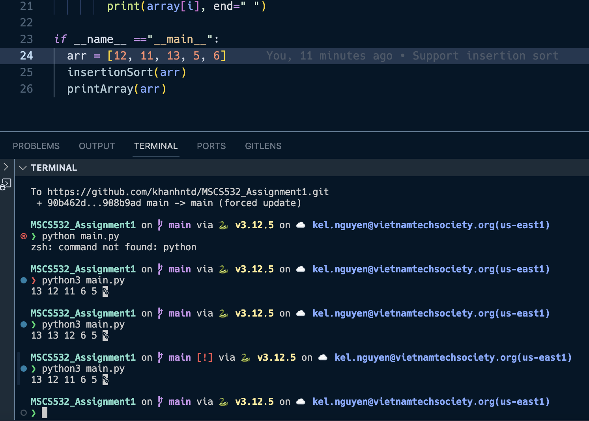

# MSCS532_Assignment1

## Setup
- **Step 1:** Download python https://www.python.org/downloads/
- **Step 2:** Download python extension from vsc https://code.visualstudio.com/

## Output
- When running the result with `python3 main.py`, 